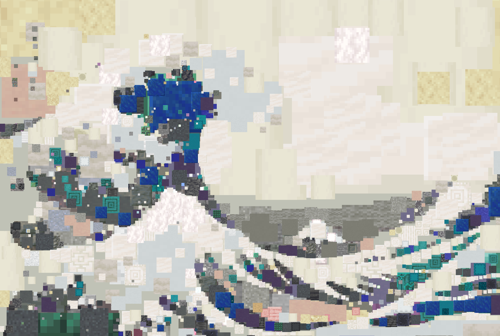
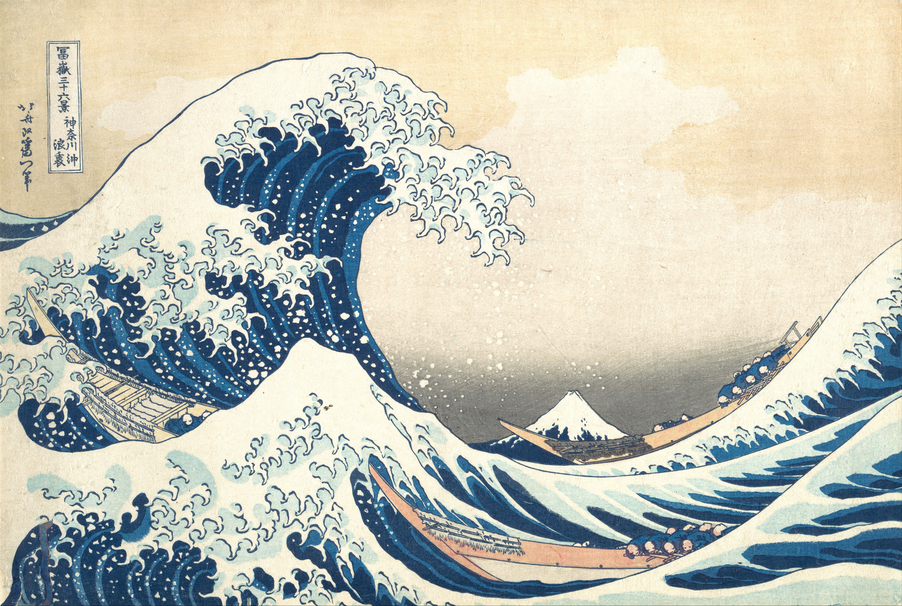
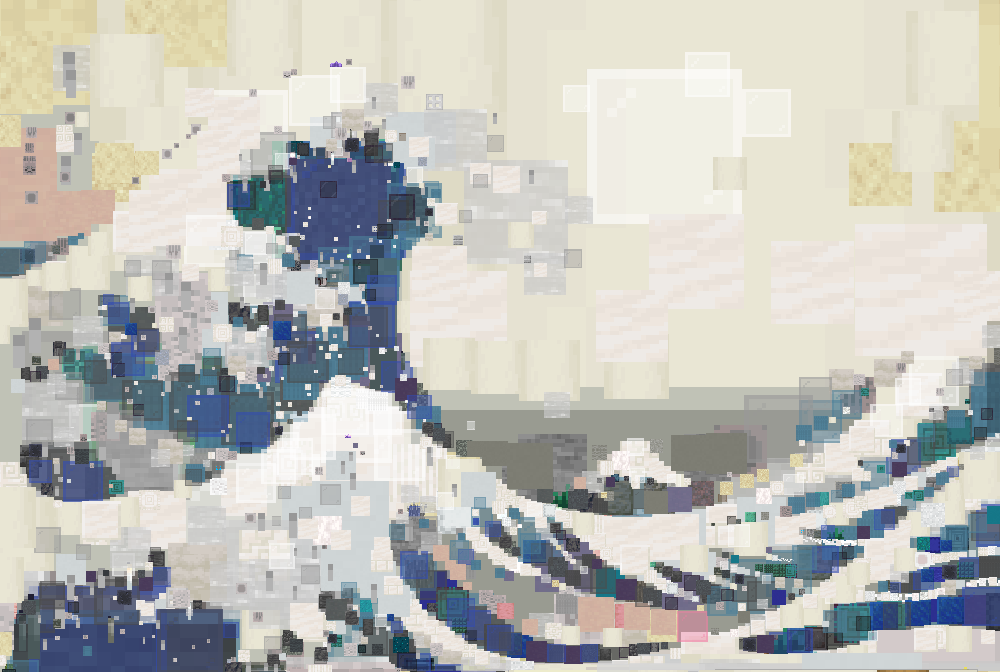
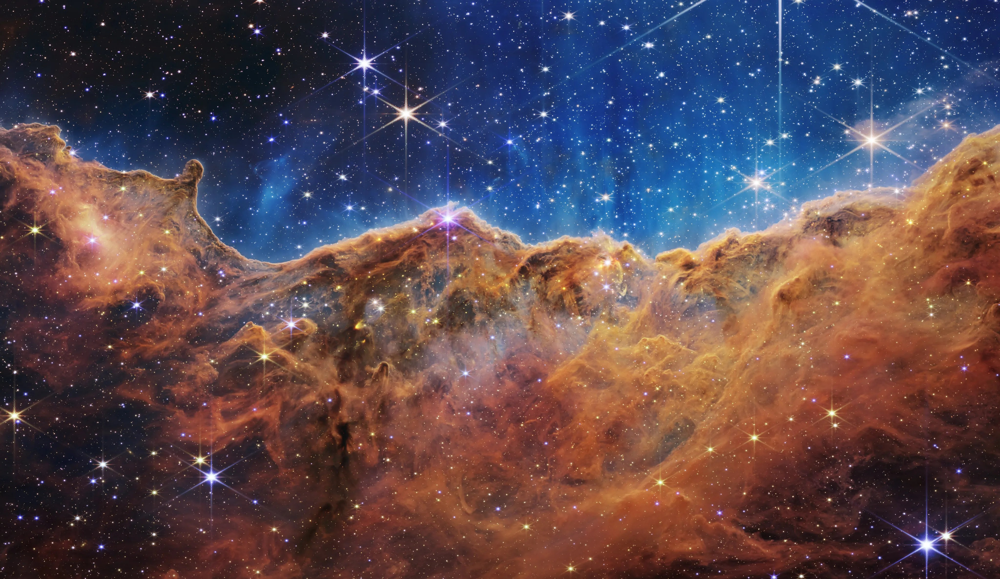
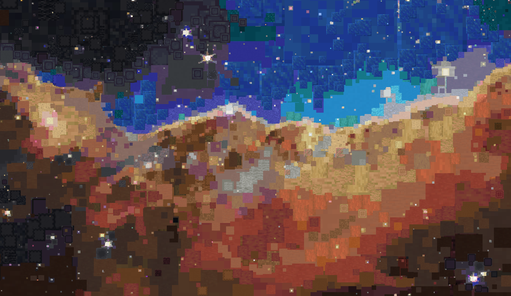
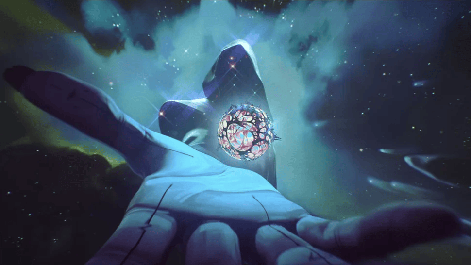
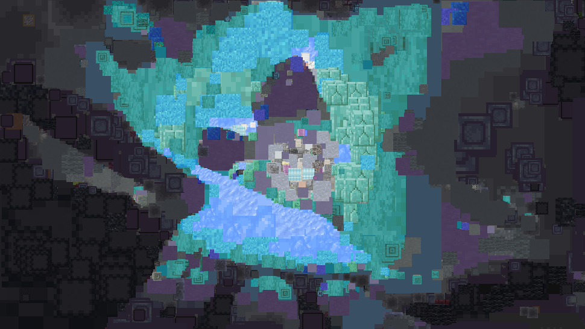
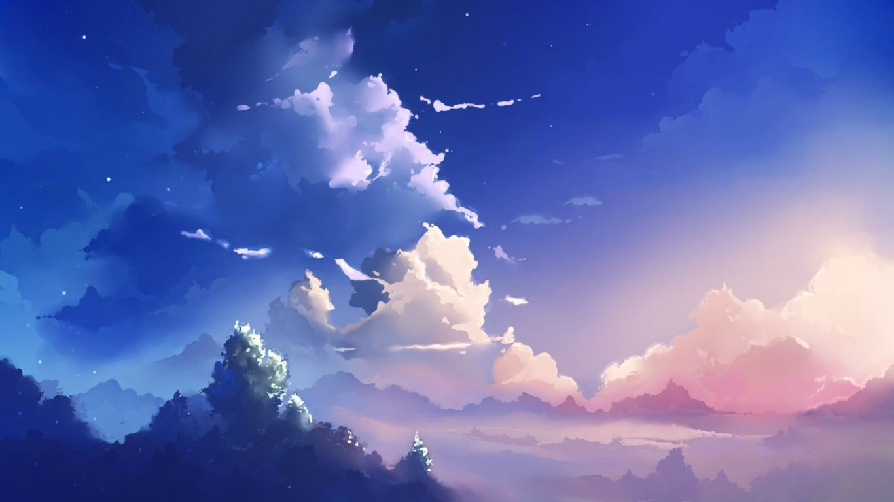
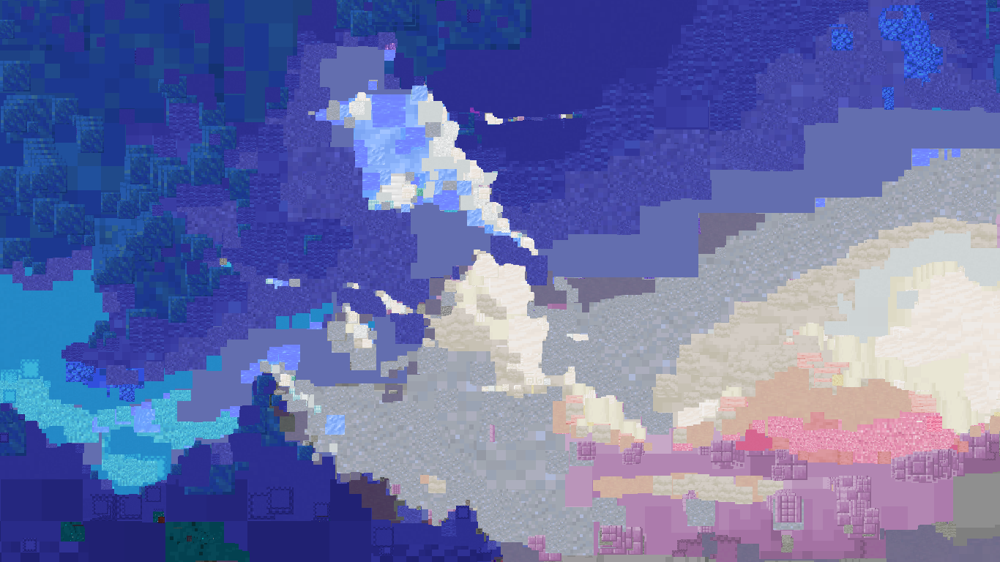

# Picture Genetics

A program that replicates images by overlapping minecraft textures using a
genetic algorithm

## The Algorithm

1. Generates random block candidates with a randomly selected Minecraft texture,
position, and scale
2. Each block is scored based on the sum of the squared difference between the
target image and the current canvas plus the block candidate
3. The list of block candidates is sorted by score and the top scoring
blocks are kept
4. Each surviving block reproduces by duplicating itself with slight variations
in location and scale
5. Random extra blocks are added to the population to avoid the genetic iteration
converging on some random bad minimum (which is highly unlikely but whatever)
6. After the genetic iteratons, if the winning block contributes negatively to
the overall score it is discarded. Otherwise the block is added to the canvas
and the next round of genetic iterations is started.

## Optimizations Used

- I used the [Rayon crate](https://crates.io/crates/rayon) where possible
to speed up loops through paralellism
- Using the `for_each_relevant_pixel` funciton, I iterate over only the pixels
that have changed when adding a block to calculate the scores. This is a
very large speed up for when the algorithm scores smaller blocks.
- I used `Arc<T>` when possible to avoid expensive clones of large objects.

## Examples

- All of the examples from when I was still getting the algorithm to work
live in `./output/bad-ones/`. Good examples live in  `./output/`

| Input | Output | Notes |
|-------|--------| ----- |
|  |  | This is the first version, with no alpha channel and transparent blocks turned off |
|  |  | this is the version that now has alpha channel and I turned on textures with transparency. This image helps show off how th e transparent blocks like glass help it more accuratley replicate colors |
|  |  | since this image is very large (4096x2372), it took a long time to generate |
|  |  | this is a frame from the show "Arcane". This showcases how the algorithm struggles to deal with intricate details |
|  |  | this image just looked nice, but I don't think the result turned out very well |
